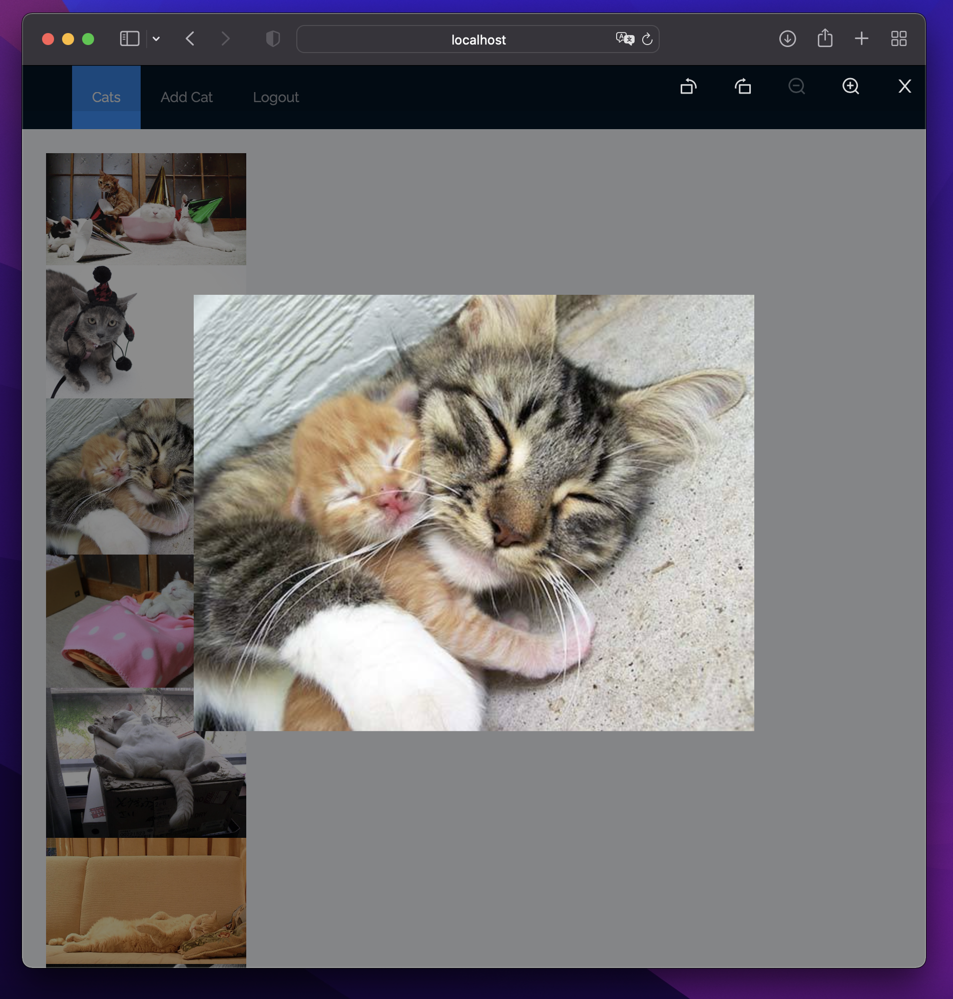
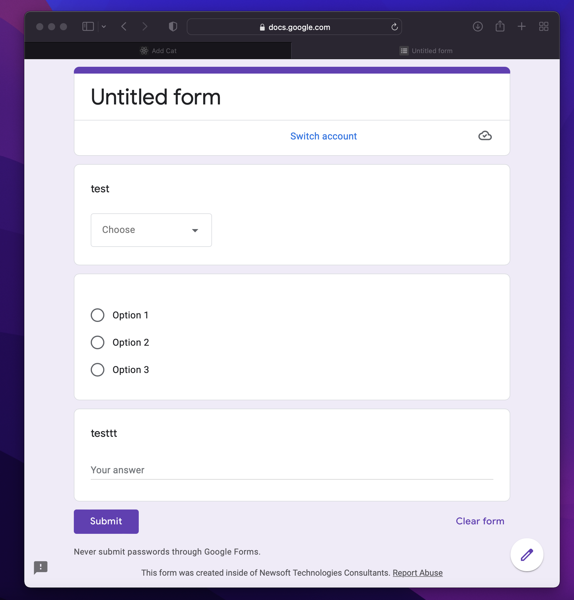

# Google form clone project

## โปรเจ็คนี้มีด้วยกัน 3 หน้าคือ 
### ทั้งระบบใช้ antd โดยส่วนมากในการจัดการ layout และใช้ formik ในการจัดการฟอร์ม

1: หน้า Login โดยสามรถใช้ username: 1, Password: 1 เพื่อเข้าระบบ 
- หน้านี้ใช้ design จาก https://codepen.io/timsux-wales/pen/JjONgeV และนำมาปรับปรุง เปลี่ยนแปลงโดยใช้ formik-antd
- Action เมื่อทำการกรอกผิด จะแสดงข้อความ alert (antd) และเมื่อนำเมาส์ไปวาง หรือไม่หรอกข้อความ จะแสดงข้อความด้านล่าง input (formik-antd) 

2: เมื่อ Login สำเร็จจะมาหน้า Cats เพื่อแสดงรูปภาพแมว กรณีที่คลิ๊กที่ รูปแบบ จะแสดงภาพใหญ่ขึ้นมา และเมื่อเลื่อนลงมาดูจะเป็นการแสดงรูปแบบแมว infinity
- ในส่วน infinite scrolling เมื่อทำการเปิดเข้ามาหน้าแรก จะเรียก API หน้าที่ 1 จำนวน 20 ชุดข้อมูล และนำมา render ไว้ และเมื่อเลื่อน scroll bar ลง จะใช้ IntersectionObserver เข้ามาช่วย ในการ trigger เมื่อเลื่อนลงมา element สุดท้าย ระบบจะทำการเรียก API หน้าต่อไป และนำข้อมูลชุดใหม่ มาต่อกับชุดเก่า และ render ต่อไปเรื่อยๆ

3: หน้า Add cat จะมีอยู่ 2 ส่วนคือ หน้าเพิ่มข้อมูลแมว และ หน้าสรุปข้อมูลแมวที่กรอกไป
- ในส่วนนี้จะใช้ state เข้ามาช่วยในการเก็บข้อมูลจากฟอร์มที่กรอกไป และไปหน้า confirm จะนำข้อมูลจาก state ที่เก็บไว้ตอนกดปุ่ม Submit ดึงมาแสดงอีกที และเมื่อทำการกดกลับไปอีกครั้ง ข้อมูลจะยังอยู่เหมือนเดิม (ในส่วนนี้เป็น mockup ที่ทำเพิ่มน้องแมวแบบหลอก ไม่ใช่การติดต่อ API) และเมื่อกกดปุ่ม confirm จะทำการเคลียร์ข้อมูลทั้งหมด
- การ design ในหน้านี้ใช้ styled-components เข้ามาช่วยในการจัด Layout ให้คล้ายคลึงกับ google form (ดังภาพล่างสุด - เนื่องจาก pdf ทดสอบให้มาเป็น link ไปที่ instagram จึงลองทำ google form มาดูเป็นตัวอย่าง และเพิ่ม step ด้านบนของ form มา โดยนำมาจาก antd

